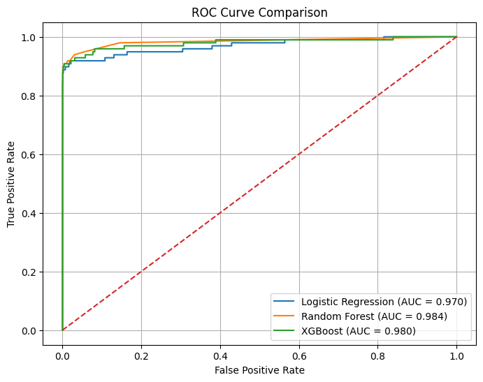
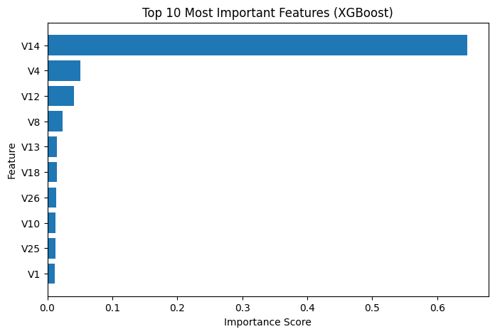

# Credit Card Fraud Detection Using Machine Learning

## Project Overview

This project focuses on detecting fraudulent credit card transactions using machine learning techniques on a highly imbalanced dataset. The dataset contains **284,807 transactions**, of which only **492 transactions (0.17%)** are fraudulent. Due to the severe class imbalance, specialized preprocessing and evaluation techniques were employed to build robust fraud detection models.

The project compares the performance of **Logistic Regression**, **Random Forest**, and **XGBoost**, with a focus on identifying the most effective model for fraud detection while balancing precision and recall.

---

## Model Performance

| Model | Precision | Recall | F1-Score | AUC-ROC |
|---------|---------:|---------:|---------:|---------:|
| Logistic Regression | 0.0581 | **0.9184** | 0.1094 | 0.9698 |
| Random Forest | **0.8404** | 0.8061 | 0.8229 | **0.9841** |
| XGBoost (Tuned) | 0.7288 | 0.8776 | 0.7963 | 0.9799 |
| XGBoost (Threshold = 0.7) | 0.8077 | 0.8571 | **0.8317** | 0.9799 |

---

## ROC Curve Comparison

The ROC curve compares the classification performance of Logistic Regression, Random Forest, and XGBoost across different decision thresholds. Random Forest achieved the highest AUC-ROC score, while XGBoost delivered competitive performance after threshold optimization.

---

## Key Findings

- The dataset exhibited extreme class imbalance, with fraud accounting for only **0.17%** of all transactions.
- **Random Forest** achieved the best overall default performance with an **AUC-ROC of 0.9841** and **F1-score of 0.8229**.
- Threshold optimization improved **XGBoost's F1-score to 0.8317**, making it the best-performing model in terms of balanced fraud detection.
- Feature importance analysis identified **V14, V12, V10, and V4** as key predictors of fraudulent activity.
- Logistic Regression achieved the highest recall (**91.84%**) but suffered from a large number of false positives.

---

## Feature Importance

Feature importance analysis was performed using the tuned XGBoost model. The results indicate that **V14** is the most influential predictor of fraudulent transactions, followed by **V4**, **V12**, **V8**, and **V10**.

---

## Dataset

**Source:** Kaggle Credit Card Fraud Detection Dataset

The dataset consists of transactions made by European cardholders. To preserve confidentiality, most features have been transformed using **Principal Component Analysis (PCA)** and are represented as anonymized variables (`V1`–`V28`).

### Dataset Summary

- Total Transactions: **284,807**
- Legitimate Transactions: **284,315**
- Fraudulent Transactions: **492**
- Fraud Rate: **0.17%**
- Features: **30**
- Target Variable: **Class**
  - `0` → Legitimate Transaction
  - `1` → Fraudulent Transaction

---

## Project Objectives

- Perform Exploratory Data Analysis (EDA) to understand data characteristics.
- Visualize and analyze the severe class imbalance.
- Scale numerical features (`Time` and `Amount`).
- Handle class imbalance using **SMOTE (Synthetic Minority Oversampling Technique)**.
- Train and evaluate multiple machine learning models.
- Compare models using Precision, Recall, F1-Score, and AUC-ROC.
- Analyze feature importance and fraud indicators.
- Study the effect of decision thresholds on model performance.

---

## Methodology

### 1. Data Exploration
- Dataset inspection
- Missing value analysis
- Class distribution visualization
- Correlation analysis
- Feature distribution analysis

### 2. Data Preprocessing
- Standardization of `Time` and `Amount`
- Stratified train-test split (80/20)
- SMOTE oversampling on training data

### 3. Model Development
- Logistic Regression (Baseline)
- Random Forest
- XGBoost
- Hyperparameter tuning using RandomizedSearchCV

### 4. Model Evaluation
- Precision
- Recall
- F1-Score
- AUC-ROC
- Confusion Matrix
- ROC Curve Analysis
- Feature Importance Analysis
- Threshold Optimization

---

## Threshold Optimization Results

To study the trade-off between fraud detection and false positives, different classification thresholds were evaluated using the tuned XGBoost model.

| Threshold | Precision | Recall | F1-Score |
|------------|------------:|------------:|------------:|
| 0.3 | 0.6350 | 0.8878 | 0.7404 |
| 0.5 | 0.7288 | 0.8776 | 0.7963 |
| 0.7 | **0.8077** | 0.8571 | **0.8317** |

Increasing the threshold improved precision while slightly reducing recall. A threshold of **0.7** achieved the best overall balance and highest F1-score.

---

## Conclusion

This project demonstrates the challenges of fraud detection in highly imbalanced datasets and highlights the importance of proper preprocessing, imbalance handling, and threshold optimization. While Logistic Regression provided a strong baseline, ensemble methods significantly improved detection quality. Random Forest delivered the strongest overall default performance, while XGBoost achieved the best F1-score after threshold tuning, illustrating the importance of selecting an appropriate decision threshold for real-world fraud detection systems.

---
